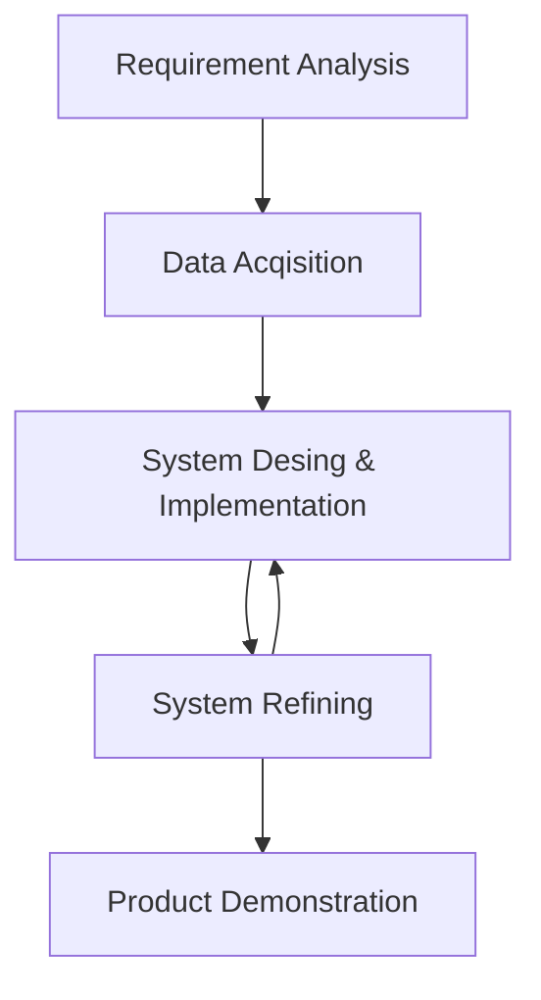

# Notes

## Requirement Analysis

- What is the problem?
- What is the goal?
- What are the requirements?
- What are the constraints?
- What are the risks?
- What are the assumptions?
- What are the dependencies?
- What are the costs?
- What are the benefits?
- What are the alternatives?
- What are the priorities?
- What are the deadlines?
- What are the milestones?
- What are the deliverables?

## Data Acqisition

- What data is needed?
- What data is available?
- What data is missing?
- What data is redundant?
- What data is inconsistent?
- What data is erroneous?
- What data is sensitive?
- What data is secure?
- What data is private?
- What data is public?
- What data is structured?
- What data is unstructured?

## System Desing & Implementation

- What is the architecture?
- What is the design?
- What is the implementation?
- What is the testing?
- What is the deployment?
- What is the maintenance?
- What is the support?
- What is the documentation?
- What is the monitoring?

## System Refining

- What is the feedback?
- What is the review?
- What is the analysis?
- What is the optimization?
- What is the improvement?
- What is the enhancement?

## System Testing

- What is the unit test?
- What is the integration test?
- What is the system test?
- What is the acceptance test?
- What is the regression test?
- What is the performance test?
- What is the stress test?
- What is the load test?
- What is the security test?
- What is the penetration test?
- What is the usability test?
- What is the accessibility test?
- What is the compatibility test?

## Product Demonstration

- What is the presentation?
- What is the demonstration?
- What is the feedback?
- What is the review?
- What is the analysis?
- What is the optimization?

